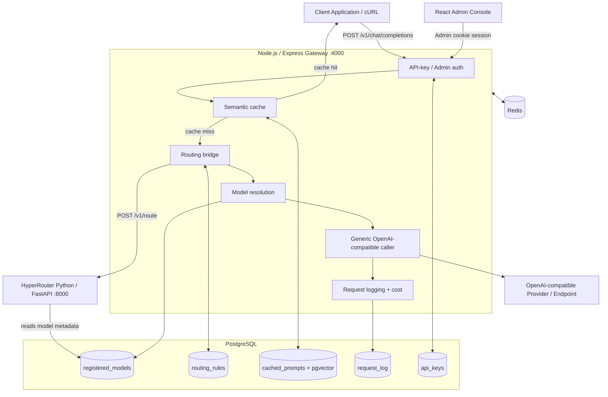

# ⚡ LLM Gateway

**A self-hosted, OpenAI-compatible LLM gateway with semantic caching, dynamic model routing, runtime model management, provider abstraction, and a React admin console.**


Point an application at one gateway endpoint instead of integrating every provider separately. The gateway authenticates the request, checks a semantic cache, asks the Python routing sidecar which registered model should handle a request, resolves the selected model from PostgreSQL, calls the provider through one generic OpenAI-compatible client, and records request/cost/latency metadata.

---

## Table of Contents

- [What It Solves](#what-it-solves)
- [Architecture](#architecture)
- [Key Features](#key-features)
- [Request Lifecycle](#request-lifecycle)
- [Dynamic Model Registry](#dynamic-model-registry)
- [Routing Policies](#routing-policies)
- [Security Model](#security-model)
- [Tech Stack](#tech-stack)
- [Project Structure](#project-structure)
- [Getting Started](#getting-started)
- [Environment Variables](#environment-variables)
- [API Reference](#api-reference)
- [Admin Console](#admin-console)
- [Validation & Testing](#validation--testing)
- [Engineering Notes](#engineering-notes)
- [Known Limitations](#known-limitations)
- [Roadmap](#roadmap)
- [Related Project — HyperRouter](#related-project--hyperrouter)

---

## What It Solves

Calling LLM providers directly from every application creates several recurring engineering problems:

- **Hardcoded model/provider integrations** make switching models a code change.
- **No central routing layer** makes it difficult to trade model quality against cost and latency.
- **Repeated prompts still cost money** when there is no semantic cache.
- **API keys and provider configuration become scattered across applications.**
- **No central observability** makes it difficult to understand model usage, cost, latency, and cache performance.

This project centralizes those responsibilities behind one gateway.

---

## Architecture



### Two-process design

**Node.js / Express gateway**

Owns everything client-facing:

- public `/v1/chat/completions`
- gateway API-key authentication
- admin authentication
- semantic cache
- model resolution
- provider API-key decryption
- generic provider calls
- request logging and cost calculation
- admin APIs

**HyperRouter Python/FastAPI sidecar**

Owns the routing decision:

- prompt-complexity scoring
- candidate filtering
- routing-policy evaluation
- selection of a registered model
- routing metadata

The sidecar does **not** own provider credentials and does not perform the final provider call in the main gateway flow.

### Single source of truth

`registered_models` in PostgreSQL is the source of truth for the model catalog.

```text
Admin UI
   ↓
Node /admin/models
   ↓
PostgreSQL registered_models
   ↓
Python ModelRegistry
   ↓
Dynamic routing
```

No model-specific provider client needs to be added when an administrator registers another OpenAI-compatible endpoint.

---

## Key Features

### 🚦 Dynamic model registry

Admins can register, update, and delete models at runtime.

Each model can define:

- internal `model_id`
- provider-side `provider_model_id`
- provider label
- OpenAI-compatible base URL
- provider API key
- input/output pricing
- capability score
- context window
- maximum output tokens
- supported features
- average latency
- description

The distinction between `model_id` and `provider_model_id` is deliberate:

```text
Internal gateway identity:
groq/openai-gpt-oss-20b

Provider identity:
openai/gpt-oss-20b
```

This prevents provider-specific naming conventions from leaking into the generic caller.

### 🧠 ML-assisted routing

The Python sidecar estimates prompt complexity and evaluates the available registered models.

Supported policies:

- **Balanced**
- **Cost Minimizing**
- **Quality Maximizing**
- **Threshold Cascade**
- **Latency Minimizing**

Routing configuration can be changed from the admin console without redeploying the application.

### 💾 Semantic caching

Prompts can be compared against previously cached requests using vector similarity in PostgreSQL/pgvector.

A successful cache hit avoids the provider call entirely.

### 🔐 Credential protection

Provider API keys are:

1. received only by the authenticated admin API,
2. encrypted with AES-256-GCM in Node.js,
3. stored as ciphertext in PostgreSQL,
4. decrypted only when Node needs to make a provider request.

The admin model-list API never returns the stored encrypted secret.

### 📊 Observability

The gateway tracks:

- cache hit/miss
- provider
- model
- prompt tokens
- completion tokens
- estimated cost
- total latency
- prompt complexity
- routing reason

The React admin console exposes this through the Dashboard and Logs screens.

---

## Request Lifecycle

For:

```json
{
  "model": "auto",
  "messages": [
    {
      "role": "user",
      "content": "Explain database indexes."
    }
  ]
}
```

the main path is:

```text
1. Client
   ↓
2. x-api-key authentication
   ↓
3. Rate limiter
   ↓
4. Semantic cache lookup
   ↓
5. Cache miss
   ↓
6. Node calls Python /v1/route
   ↓
7. Python evaluates registered models
   ↓
8. Selected internal model ID returned
   ↓
9. Node reads selected model from PostgreSQL
   ↓
10. Provider key decrypted in Node
   ↓
11. provider_model_id sent to generic provider caller
   ↓
12. Provider /chat/completions
   ↓
13. Response cached + request logged
   ↓
14. Client receives response + routing metadata
```

### Explicit model mode

A caller can bypass routing:

```json
{
  "model": "groq/openai-gpt-oss-20b",
  "messages": [
    {
      "role": "user",
      "content": "Hello"
    }
  ]
}
```

The gateway verifies that the model is registered, skips automatic selection, and calls that registered model directly.

---

## Dynamic Model Registry

The administrator can add a model from the React Models screen or through:

```http
POST /admin/models
```

Example:

```json
{
  "modelId": "groq/openai-gpt-oss-20b",
  "providerModelId": "openai/gpt-oss-20b",
  "providerLabel": "groq",
  "baseUrl": "https://api.groq.com/openai/v1",
  "apiKey": "PROVIDER_SECRET",
  "inputCostPerM": 0.0,
  "outputCostPerM": 0.0,
  "capabilityScore": 0.55,
  "contextWindow": 131072,
  "maxOutputTokens": 32768,
  "features": ["tools", "json_mode", "streaming"],
  "avgLatencyMs": 500,
  "description": "Example registered model"
}
```

After the write:

```text
Node writes PostgreSQL
       ↓
Node triggers /internal/models/reload
       ↓
Python refreshes ModelRegistry
       ↓
New model becomes available to routing
```

The same flow works for model updates and deletion.

---

## Routing Policies

### Balanced

Balances capability fit against estimated request cost.

Conceptually:

```text
utility = capability_fit - (lambda_cost × estimated_cost)
```

The `lambda_cost` value controls how strongly cost influences the selection.

### Cost Minimizing

Chooses the cheapest model among those that meet the configured capability criteria.

If no candidate is sufficiently capable, the router uses the strongest available candidate rather than silently downgrading to the cheapest model.

### Quality Maximizing

Prefers the highest-capability registered model.

### Threshold Cascade

Uses a complexity threshold:

```text
complexity < threshold
    → cheapest qualified model

complexity >= threshold
    → strongest available model
```

### Latency Minimizing

Prefers the fastest qualified model based on registered latency metadata.

---

## Security Model

### Gateway API keys

Client gateway keys are generated by the admin API and stored as SHA-256 hashes.

Clients send:

```http
x-api-key: gwk_...
```

The raw value is only available at creation time.

### Admin authentication

The admin console uses JWT-based access/refresh cookies.

The access token is stored in an `httpOnly` cookie and protected admin routes require that cookie.

### Provider keys

Provider secrets are encrypted with AES-256-GCM before being stored in PostgreSQL.

The frontend never receives `api_key_encrypted`.

### Important separation

```text
Gateway API key
    ↓
Authenticates your client

Provider API key
    ↓
Authenticates your gateway to the upstream LLM provider
```

These are different credentials with different responsibilities.

---

## Tech Stack

| Layer | Technology |
|---|---|
| Public gateway | Node.js + Express |
| Routing engine | Python + FastAPI |
| Database | PostgreSQL 16 + pgvector |
| Cache / rate limiting | Redis |
| Semantic embeddings | Cohere |
| Complexity scoring | Python + Sentence Transformers / trained scoring artifact |
| Provider execution | Generic OpenAI-compatible HTTP client |
| Authentication | JWT, httpOnly cookies, bcrypt |
| Provider secret encryption | AES-256-GCM |
| Admin frontend | React, Vite, React Router, Tailwind CSS |
| Charts | Recharts |
| Local infrastructure | Docker Compose |

---

## Project Structure

```text
LLM-gateway/
├── backend/
│   ├── src/
│   │   ├── server.js
│   │   ├── routes/
│   │   │   ├── proxy.js
│   │   │   ├── adminAuth.js
│   │   │   ├── apiKeys.js
│   │   │   ├── routingRules.js
│   │   │   ├── logs.js
│   │   │   ├── stats.js
│   │   │   └── admin/
│   │   │       └── models.js
│   │   ├── services/
│   │   │   ├── cache.js
│   │   │   ├── router.js
│   │   │   ├── routingRulesStore.js
│   │   │   ├── registeredModels.js
│   │   │   └── providers/
│   │   │       └── generic.js
│   │   ├── middleware/
│   │   ├── utils/
│   │   ├── db/
│   │   └── scripts/
│   └── package.json
│
├── frontend/
│   └── src/
│       ├── pages/
│       │   ├── Login.jsx
│       │   ├── Dashboard.jsx
│       │   ├── ApiKeys.jsx
│       │   ├── Models.jsx
│       │   ├── Logs.jsx
│       │   └── RoutingRules.jsx
│       ├── hooks/
│       │   ├── useStats.js
│       │   ├── useLogs.js
│       │   ├── useApiKeys.js
│       │   ├── useModels.js
│       │   └── useRoutingRules.js
│       ├── components/
│       ├── context/
│       └── lib/
│
└── hyper-router/
    └── gateway/
        ├── server.py
        ├── router.py
        ├── models.py
        ├── filter.py
        └── complexity_scorer.py
```

---

## Getting Started

### Prerequisites

- Node.js 18+
- Python 3.9+
- Docker
- PostgreSQL 16 + pgvector
- Redis
- At least one OpenAI-compatible provider API key

### 1. Start PostgreSQL and Redis

```bash
cd backend
docker compose up -d
```

Make sure the database is reachable using the connection string configured in your environment.

### 2. Configure the Python sidecar

```bash
cd ../hyper-router

python -m venv .venv
```

Windows:

```powershell
.\.venv\Scriptsctivate
```

macOS/Linux:

```bash
source .venv/bin/activate
```

Install dependencies:

```bash
pip install -r requirements.txt
```

Set:

```text
DATABASE_URL=postgresql://...
```

Start:

```bash
python -m uvicorn gateway.server:app --port 8000
```

### 3. Configure the Node gateway

Create:

```text
backend/.env
```

with the variables listed in [Environment Variables](#environment-variables).

Then:

```bash
cd ../backend
npm install
npm run dev
```

Default:

```text
http://localhost:4000
```

### 4. Run the frontend

```bash
cd ../frontend
npm install
npm run dev
```

Default:

```text
http://localhost:5173
```

The Vite development server proxies admin/API requests to the Node gateway.

### 5. Register a model

Log into the admin panel and open:

```text
Models
```

Register at least one provider-backed model before sending traffic through:

```text
POST /v1/chat/completions
```

---

## Environment Variables

### Backend

| Variable | Purpose |
|---|---|
| `PORT` | Node gateway port; default `4000` |
| `DATABASE_URL` | PostgreSQL connection string |
| `REDIS_URL` | Redis connection string |
| `JWT_SECRET` | Signs admin JWTs |
| `MODEL_KEY_ENCRYPTION_SECRET` | 32-byte hex key used by AES-256-GCM |
| `HYPER_ROUTER_URL` | Python routing sidecar URL; default `http://localhost:8000` |
| `COHERE_API_KEY` | Semantic-cache embedding API key, if enabled |
| `GROQ_FALLBACK_MODEL` | Optional fallback used by the current Node sidecar-failure path |
| `SEED_ADMIN_EMAIL` | Initial admin account email |
| `SEED_ADMIN_PASSWORD` | Initial admin account password |
| `NODE_ENV` | Use `production` for production cookie behavior |

### Python sidecar

At minimum:

```text
DATABASE_URL=postgresql://...
```

Keep secrets in environment variables or a proper secret manager. Do not commit `.env` files.

---

## API Reference

### `POST /v1/chat/completions`

Main client endpoint.

Authentication:

```http
x-api-key: YOUR_GATEWAY_KEY
```

Example:

```bash
curl http://localhost:4000/v1/chat/completions   -H "Content-Type: application/json"   -H "x-api-key: $GATEWAY_KEY"   -d '{
    "model": "auto",
    "messages": [
      {
        "role": "user",
        "content": "Explain what a Bloom filter is."
      }
    ],
    "policy": "balanced",
    "lambda_cost": 100
  }'
```

The gateway response includes the provider result plus routing and usage metadata.

### `POST /v1/route`

Inspect a routing decision without calling the upstream model:

```bash
curl http://localhost:8000/v1/route   -H "Content-Type: application/json"   -d '{
    "prompt": "Explain why database indexes improve query performance.",
    "policy": "balanced",
    "lambda_cost": 100,
    "cascade_threshold": 0.60,
    "capability_margin": 0.08,
    "min_capability_floor": 0.0,
    "enable_cascade_fallback": true
  }'
```

### `GET /v1/models`

Lists the models currently loaded by the Python registry.

### `POST /admin/models`

Create or update a registered model.

### `GET /admin/models`

List models without returning provider secrets.

### `DELETE /admin/models/:modelId`

Remove a model from the runtime routing pool.

### `GET /admin/routing-rules`

Read the current routing configuration.

### `PUT /admin/routing-rules`

Update the routing configuration.

### `GET /v1/stats`

Read aggregate gateway metrics for the admin dashboard.

---

## Admin Console

The React console currently contains:

```text
Dashboard
API Keys
Models
Logs
Routing Rules
```

### Models

The Models page lets administrators:

- register a model
- update model metadata
- rotate a provider API key
- view pricing/capability/context/latency metadata
- delete a model

### Routing Rules

The Routing Rules page controls:

- routing policy
- cost sensitivity (`lambda_cost`)
- cascade threshold
- capability margin
- minimum capability floor
- fallback behavior
- semantic-cache similarity threshold

This cleanly separates:

```text
Models
= What is available?

Routing Rules
= How should the router choose?
```

---

## Validation & Testing

The project was validated incrementally against the live local stack.

Verified flows include:

- PostgreSQL-backed model persistence
- runtime model registration
- runtime model update
- runtime model deletion
- Python registry refresh
- multi-model candidate evaluation
- prompt-complexity scoring
- balanced routing
- cost-minimizing routing
- capability-aware fallback behavior when no model meets the requested capability
- explicit registered-model selection
- provider-model ID separation
- encrypted provider API-key storage
- generic OpenAI-compatible provider execution
- gateway API-key authentication
- React Models integration
- React Routing Rules integration

A representative routing result showed two registered candidates being evaluated for the same request:

```json
{
  "candidates_evaluated": 2,
  "prompt_complexity": 0.9738,
  "selected_model": "..."
}
```

Warm routing after the local embedding model had been loaded was measured in the sub-millisecond range during development tests.

These are **local integration results**, not a formal production benchmark.

---

## Engineering Notes

### Why a separate Python routing sidecar?

The routing engine is isolated from the Node provider layer so routing can evolve independently from the client-facing gateway.

The Node gateway owns:

```text
authentication
cache
provider calls
admin APIs
logging
```

while Python owns:

```text
complexity scoring
candidate filtering
routing policies
model selection
```

### Why `provider_model_id` exists

Provider/model naming conventions are not universal.

For example:

```text
Internal:
groq/openai-gpt-oss-20b

Provider:
openai/gpt-oss-20b
```

The generic caller should not contain rules like:

```js
model.replace("groq/", "")
```

Instead, the database explicitly stores the provider-side identifier.

### Why PostgreSQL is the source of truth

The Python sidecar keeps an in-memory registry for fast routing, but PostgreSQL remains authoritative.

Updates therefore follow:

```text
PostgreSQL
   ↓
ModelRegistry.refresh()
   ↓
fast in-memory routing
```

The Node admin API can trigger an immediate refresh, while the sidecar also refreshes periodically.

### Why Redis is used for routing rules

Routing configuration is read frequently but changed relatively rarely.

Redis provides a small cached layer while updates explicitly invalidate the cached configuration, so administrator changes take effect immediately after a save.

---

## Known Limitations

- The complexity scorer is not perfectly calibrated for every prompt style and remains an area for further evaluation.
- Provider availability depends on the credentials and project permissions of the configured provider.
- The development environment has been exercised locally; production load testing and distributed deployment have not been completed.
- The generic provider layer currently targets OpenAI-compatible `/chat/completions` interfaces. Providers with materially different protocols need an adapter or a compatible gateway endpoint.
- The Python embedding model has a cold-start cost after process restart; warm routing is much faster.
- The current provider-side failure fallback remains configurable and should be tested and hardened before relying on it for production high availability.

---

## Roadmap

### Gateway hardening

- structured logging
- distributed tracing
- stronger request validation
- graceful shutdown and health/readiness separation
- retry/circuit-breaker policies for upstream providers

### Routing

- larger labeled evaluation sets
- calibration of prompt-complexity scores
- smarter fallback selection
- model health tracking based on recent provider latency/error rates
- richer Pareto-frontier analysis

### Model registry

- provider capability discovery
- health checks for registered endpoints
- model activation/deactivation
- per-model quotas
- versioned model metadata

### Deployment

- containerize the complete stack
- production Postgres/Redis deployment
- CI/CD
- secret-manager integration
- hosted observability

---

## Related Project — HyperRouter

The routing engine used by this gateway is maintained as a separate Python/FastAPI project:

**HyperRouter:** https://github.com/mahek395/hyper-router

This gateway integrates HyperRouter as a sidecar rather than making it responsible for the final provider call.


---

<p align="center">
  Built with Node.js, Python, PostgreSQL, Redis, FastAPI, and React.
</p>
